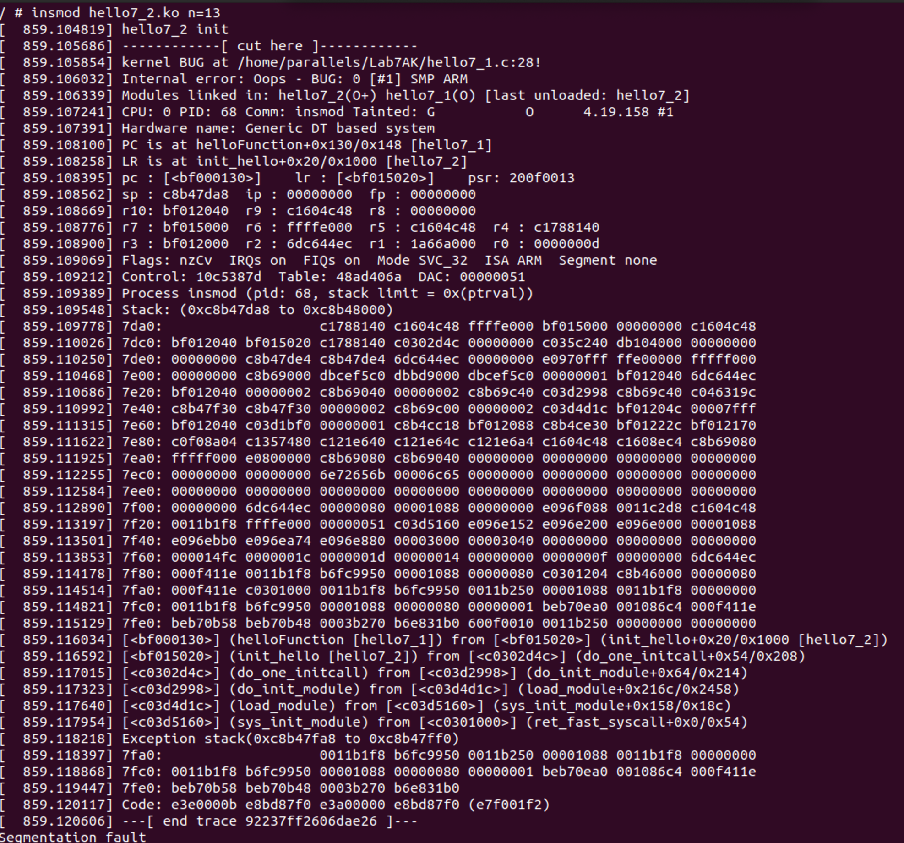
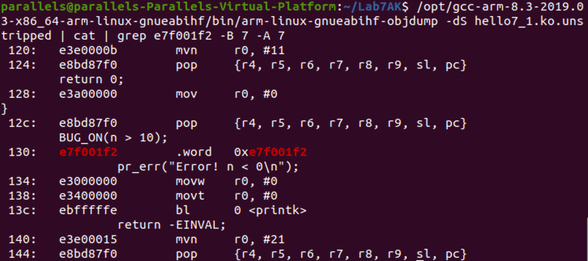

# Lab7AK
#### Результати виконання:



## Пошук помилки



## Лістинг:

### hello1.h

```cpp
#include <linux/types.h>

int helloFunction(uint n);
```

### hello7_1.cpp

```cpp
// SPDX-License-Identifier: GPL-2-Clause

#include <linux/init.h>
#include <linux/module.h>
#include <linux/printk.h>
#include <linux/types.h>
#include <linux/slab.h>
#include <linux/ktime.h>
#include <hello1.h>

MODULE_LICENSE("Dual BSD/GPL");
MODULE_AUTHOR("Gusakova IV-82\n");
MODULE_DESCRIPTION("Lab7: hello7_1.c\n");

struct timeit_list {
	struct list_head node;
	ktime_t before;
	ktime_t after;
};

static struct list_head head_node = LIST_HEAD_INIT(head_node);

int helloFunction(uint n)
{
	struct timeit_list *list, *tmp;
	uint i;

	BUG_ON(n > 10);

	if (n <= 0) {
		pr_err("Error! n < 0\n");
		return -EINVAL;
	} else if (n == 0) {
		pr_warn("Error! n < 0\n");
	} else if (n >= 5 && n <= 10) {
		pr_warn("Warning! 5 <= n <= 10\n");
	}

	for (i = 0; i < n; i++) {
		list = kmalloc(sizeof(struct timeit_list), GFP_KERNEL);
		if (i == 7)
			list = NULL;
		if (ZERO_OR_NULL_PTR(list))
			goto clean_up;

		list->before = ktime_get();
		pr_info("Hello, world!!!\n");
		list->after = ktime_get();
		list_add_tail(&list->node, &head_node);
	}
	return 0;

clean_up:
	list_for_each_entry_safe(list, tmp, &head_node, node) {
		list_del(&list->node);
		kfree(list);
	}
	pr_err("ERROR!!! Memory is out\n");
	return -ENOMEM;
}
EXPORT_SYMBOL(helloFunction);


static int __init init_hello(void)
{
	pr_info("hello7_1 init\n");
	return 0;
}


static void __exit exit_hello(void)
{
	struct timeit_list *list, *tmp;

	list_for_each_entry_safe(list, tmp, &head_node, node) {
		pr_info("Time: %lld", list->after - list->before);
		list_del(&list->node);
		kfree(list);
	}

	pr_info("hello7_1 exit\n");
}


module_init(init_hello);
module_exit(exit_hello);

```

### hello7_2.cpp

```cpp
// SPDX-License-Identifier: GPL-2-Clause

#include <linux/init.h>
#include <linux/module.h>
#include <linux/printk.h>
#include <linux/types.h>
#include <linux/slab.h>
#include <linux/ktime.h>
#include <hello1.h>

MODULE_LICENSE("Dual BSD/GPL");
MODULE_DESCRIPTION("Lab7: hello7_2.c\n");
MODULE_AUTHOR("Gusakova IV-82\n");

static uint n = 1;

module_param(n, uint, 0);
MODULE_PARM_DESC(n, "How many hello you want to print?\n");

static int __init init_hello(void)
{
	pr_info("hello7_2 init\n");
	helloFunction(n);
	return 0;
}

static void __exit exit_hello(void)
{
	pr_info("hello7_2 exit\n");
}

module_init(init_hello);
module_exit(exit_hello);

```

### Makefile

```makefile
ccflags-y := -I$(PWD)/inc
ifneq ($(KERNELRELEASE),)
# kbuild part of makefile
obj-m := hello7_1.o hello7_2.o
ccflags-y += -g -DDEBUG
else
# normal makefile
KDIR ?= /lib/modules/`uname -r`/build
default:
	$(MAKE) -C $(KDIR) M=$$PWD
	cp hello7_1.ko hello7_1.ko.unstripped
	cp hello7_2.ko hello7_2.ko.unstripped
	$(CROSS_COMPILE)strip -g hello7_1.ko
	$(CROSS_COMPILE)strip -g hello7_2.ko
clean:
	$(MAKE) -C $(KDIR) M=$$PWD clean
%.s %.i: %.c
	$(MAKE) -C $(KDIR) M=$$PWD $@
endif

```
